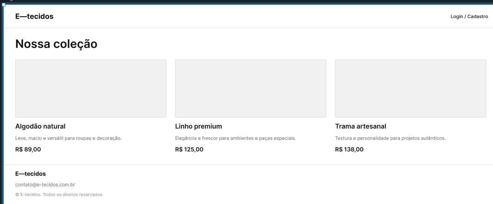
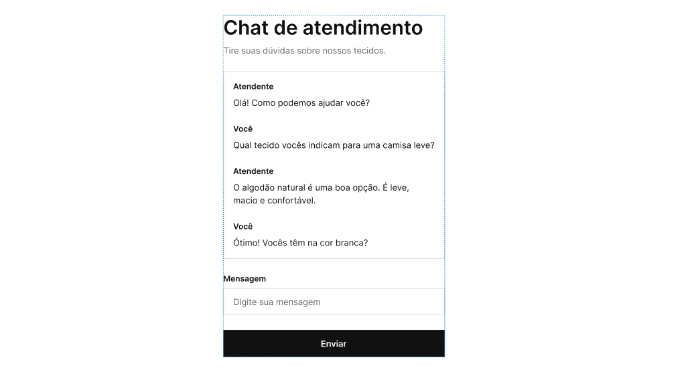
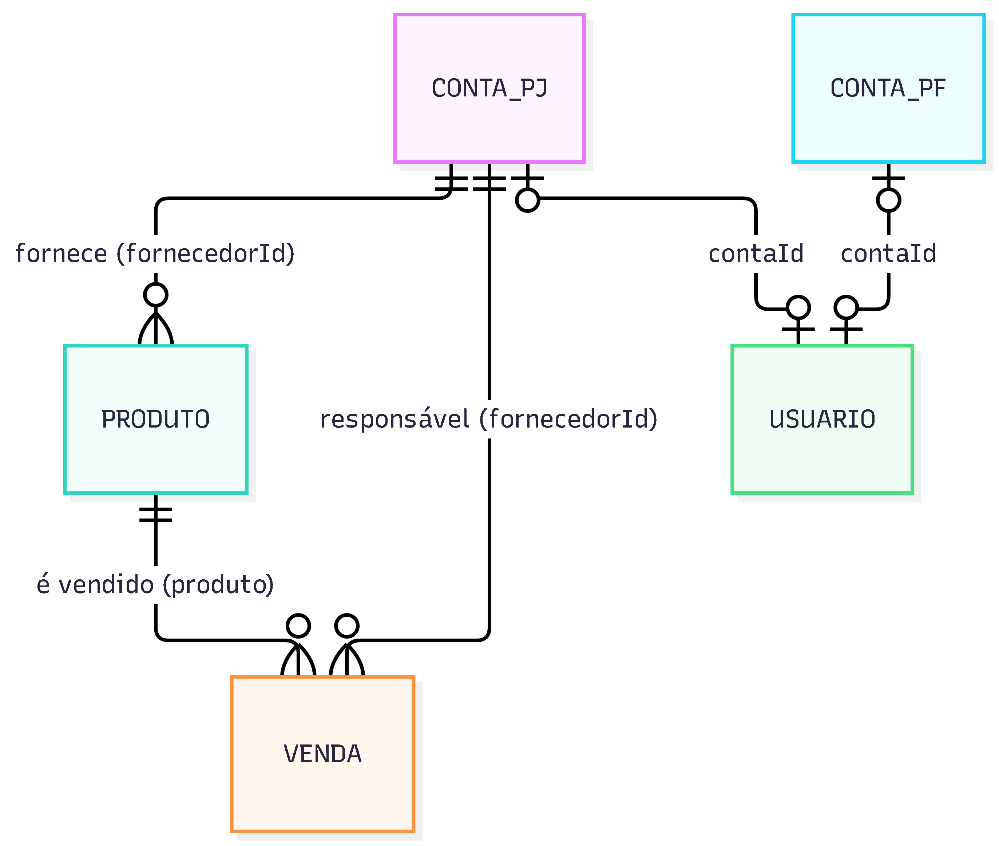

# E-tecidos

Loja demonstrativa de tecidos feita com **React**, **Vite**, **React Router**, **Bootstrap** e **JSON Server**. Inclui catálogo de produtos, carrinho, login de demonstração e áreas administrativas para vendas, produtos e contas.

## Protótipos

### Loja



### Login


### Chat


## Funcionalidades

- **Loja**: catálogo de tecidos com cards de produto e detalhes expansíveis.
- **Carrinho**: adicionar, alterar quantidade, remover e limpar itens (exige login).
- **Login e cadastro**, com perfis de acesso por permissão.
- **Painel administrativo**: histórico de vendas, gestão de produtos e gestão de contas de pessoa física e pessoa jurídica.
- **Cabeçalho e rodapé** compartilhados, com layout responsivo (desktop e mobile).

## Rotas

| Rota | Acesso | Descrição |
| --- | --- | --- |
| `/` | Público | Loja |
| `/login` | Público | Entrar |
| `/cadastro` | Público | Criar conta |
| `/carrinho` | Usuário logado | Carrinho |
| `/admin` | `vendas:read` | Painel de vendas |
| `/admin/produtos` | `produtos:write` | Gestão de produtos |
| `/admin/contas/pessoa-fisica` | `contas:manage` | Contas de pessoa física |
| `/admin/contas/pessoa-juridica` | `contas:manage` | Contas de pessoa jurídica |

## Requisitos

- Node.js compatível com a versão do Vite instalada
- npm

## Instalação e execução

```bash
npm install
```

Em um terminal, inicie a API:

```bash
npm run server
```

Em outro terminal, inicie a aplicação:

```bash
npm run dev
```

Abra `http://localhost:5173`. O JSON Server roda em `http://localhost:3001`; o Vite encaminha as chamadas com prefixo `/api` para ele.

O `npm run server` executa antes o `npm run db:build`, que combina as sementes de `src/data` em `server/db.json`.

## Usuários de demonstração

| Perfil | E-mail | Senha | Acesso |
| --- | --- | --- | --- |
| Administrador | `admin@e-tecidos.com.br` | `Admin@123` | Vendas, produtos e contas |
| Fornecedor PJ | `compras@casaaurora.exemplo.com` | `Fornecedor@123` | Consulta de vendas e CRUD dos próprios produtos |
| Cliente PF | `marina.albuquerque@exemplo.com` | `Cliente@123` | Loja e carrinho, sem painel administrativo |

A área de contas é exclusiva do administrador. O fornecedor pode consultar vendas, mas não criá-las, editá-las ou excluí-las.

## Modelo de dados

### Entidades

Cinco entidades ficam na API (JSON Server) e duas ficam só no navegador.

| Entidade | Coleção / armazenamento | Id | Descrição |
| --- | --- | --- | --- |
| **Produto** | `produtos` | slug (`algodao`) | Tecido do catálogo, com preço por metro e fornecedor |
| **Venda** | `vendas` | `V-1048` | Venda de um produto, exibida no histórico do painel |
| **Conta PF** | `contasPessoaFisica` | `PF-001` | Conta de cliente pessoa física |
| **Conta PJ** | `contasPessoaJuridica` | `PJ-001` | Conta de empresa; também é o fornecedor |
| **Usuário** | `usuarios` | `USR-001` | Credencial de login com tipo de perfil e permissões |
| **Carrinho** | `localStorage` | - | Itens do carrinho, um só por navegador |
| **Sessão** | `sessionStorage` | - | Usuário autenticado, dura enquanto a aba estiver aberta |

### Campos

**Produto**

| Campo | Tipo | Observação |
| --- | --- | --- |
| `id` | texto | Chave primária (slug gerado a partir do título) |
| `titulo` | texto | |
| `resumo` | texto | Texto curto do card |
| `detalhe` | texto | Texto do "Saiba mais" |
| `imagem` | texto (URL) | |
| `alt` | texto | Texto alternativo da imagem |
| `preco` | número | Preço por metro |
| `custoPorMetro` | número | Estimativa fictícia, usada no lucro bruto do painel |
| `fornecedorId` | texto | Referência a `Conta PJ.id` |

**Venda**

| Campo | Tipo | Observação |
| --- | --- | --- |
| `id` | texto | Chave primária (`V-` + número) |
| `data` | data (AAAA-MM-DD) | |
| `cliente` | texto | Nome livre, não é referência a uma conta |
| `tipo` | texto | `fisica` ou `juridica` |
| `produto` | texto | Referência a `Produto.id` |
| `metros` | número | |
| `status` | texto | `Pago`, `Pendente` ou `Cancelado` |
| `pagamento` | texto | Ex.: `Crédito 3x` |
| `valor` | número | |
| `fornecedorId` | texto | Referência a `Conta PJ.id` |

**Conta PF**

| Campo | Tipo | Observação |
| --- | --- | --- |
| `id` | texto | Chave primária (`PF-` + número) |
| `nome` | texto | |
| `cpf` | texto | |
| `email` | texto | |
| `nascimento` | data (AAAA-MM-DD) | |
| `endereco` | texto | |
| `status` | texto | `ativa` ou `suspensa` |
| `criadoEm` | data (AAAA-MM-DD) | |

**Conta PJ**

| Campo | Tipo | Observação |
| --- | --- | --- |
| `id` | texto | Chave primária (`PJ-` + número) |
| `razaoSocial` | texto | |
| `cnpj` | texto | |
| `email` | texto | |
| `localizacao` | texto | |
| `descricao` | texto | |
| `status` | texto | `ativa` ou `suspensa` |
| `criadoEm` | data (AAAA-MM-DD) | |

**Usuário**

| Campo | Tipo | Observação |
| --- | --- | --- |
| `id` | texto | Chave primária (`USR-` + número) |
| `nome` | texto | |
| `email` | texto | Usado no login |
| `senha` | texto | Guardada sem hash (apenas demonstração) |
| `tipo` | texto | `admin`, `juridica` ou `fisica` |
| `contaId` | texto | Referência a `Conta PF.id` ou `Conta PJ.id`; nulo no administrador |
| `permissoes` | lista de textos | `vendas:read`, `vendas:write`, `produtos:write`, `contas:manage` |

**Carrinho** (`localStorage`, chave `e-tecidos-carrinho`): lista de itens com `id` (id do produto) e `quantidade`.

**Sessão** (`sessionStorage`): `id`, `nome`, `email`, `tipo`, `contaId` e `permissoes` do usuário. A senha não é guardada.

### Relacionamentos



- Um fornecedor é uma conta de pessoa jurídica. `fornecedorId`, em Produto e em Venda, aponta para `Conta PJ.id`.
- `Venda.produto` aponta para `Produto.id`.
- `Usuario.contaId` liga o login à conta do cliente (`PF-...`) ou do fornecedor (`PJ-...`). No administrador é nulo.
- `permissoes` não é chave estrangeira: define quais rotas e ações o usuário acessa.

### Matriz CRUD

C = criar, R = ler, U = atualizar (inclui suspender e reativar contas), D = excluir.
**X** = permitido · **P** = permitido só nos registros do próprio fornecedor (filtro por `fornecedorId`) · **-** = sem acesso pela interface.

| Entidade | Visitante | Cliente PF | Fornecedor PJ | Administrador |
| --- | :---: | :---: | :---: | :---: |
| | C R U D | C R U D | C R U D | C R U D |
| **Produto** | - X - - | - X - - | P X P P | X X X X |
| **Venda** | - - - - | - - - - | - P - - | X X X X |
| **Conta PF** | - - - - | - - - - | - - - - | X X X X |
| **Conta PJ** | - - - - | - - - - | - - - - | X X X X |
| **Usuário** | - X - - | - X - - | - X - - | - X - - |
| **Carrinho** | - - - - | X X X X | X X X X | X X X X |
| **Sessão** | X - - - | - X - X | - X - X | - X - X |

Observações:

- **Vendas:** ler exige `vendas:read` e criar, editar e excluir exigem `vendas:write`. Nenhuma tela de compra grava vendas; elas só nascem no painel do administrador.
- **Contas:** o cadastro público (`/cadastro`) ainda não grava a conta, apenas escreve no console.
- **Usuários:** não há tela para criar, editar ou excluir. A leitura acontece no login, que baixa a coleção inteira e compara e-mail e senha no navegador.
- **Carrinho e sessão:** o carrinho exige login para adicionar e ver. A sessão é criada no login e apagada ao sair.

## API

Coleções: `produtos`, `vendas`, `contasPessoaFisica`, `contasPessoaJuridica` e `usuarios`.

```text
GET    /api/produtos
POST   /api/produtos
PUT    /api/produtos/:id
DELETE /api/produtos/:id
```

O cliente HTTP está em `src/utils/api.js`. As coleções consultadas ficam em cache no `localStorage` para exibição imediata e são atualizadas em segundo plano.

## Dados e persistência

Os arquivos de `src/data` são as sementes iniciais (`produtosdb.json`, `vendasdb.json`, `contasPessoasFisicasdb.json`, `contasPessoasJuridicasdb.json`, `usuariosdb.json` e `configContasAdmin.json`). O `configContasAdmin.json` não é uma entidade: só descreve as colunas e os campos dos formulários das telas de contas.

O JSON Server grava as alterações em `server/db.json` durante a execução. Ao rodar `npm run server` de novo, esse arquivo é recriado a partir das sementes, e as alterações feitas pela API não voltam para `src/data`.

## Estrutura

```text
scripts/
  build-db.js     Gera server/db.json a partir das sementes
server/
  db.json         Banco agregado do JSON Server (gerado)
src/
  auth/           Contexto, sessão, permissões e guardas de rota
  components/     Header, Bottom (rodapé), ProdutoCard, Carrinho, AdminLayout
  data/           Sementes e configuração em JSON
  hooks/          Estado e operações das telas
  pages/          Loja, login, cadastro e páginas administrativas
  styles/         Tema visual e estilos por página
  utils/          Cliente da API e funções auxiliares
```

## Comandos

```bash
npm run dev       # inicia o Vite
npm run server    # gera o banco e inicia o JSON Server
npm run db:build  # regenera somente server/db.json
npm run build     # cria o bundle de produção
npm run preview   # serve o bundle de produção
npm run lint      # executa o ESLint
```

## Segurança

Este projeto é uma demonstração local. O JSON Server expõe usuários e senhas sem hash, e as permissões e o escopo por fornecedor são aplicados apenas no frontend: a API não bloqueia nenhuma operação. Não use essas credenciais, esse mecanismo de sessão nem o JSON Server em produção. Para isso, é preciso autenticação no servidor, armazenamento seguro de senhas e autorização em cada endpoint.


## Pendências

Funcionalidades ainda não implementadas. Ambas dependem do login e dos perfis já existentes.

### Avaliação de produtos

Permite que clientes avaliem os tecidos que compraram e que a loja exiba a opinião de quem já usou.

**Comportamento planejado**

- O cliente PF dá uma nota de 1 a 5 e, se quiser, escreve um comentário sobre o produto.
- Só pode avaliar quem tem uma venda com status `Pago` daquele produto, e apenas uma avaliação por venda.
- O card e os detalhes do produto mostram a nota média e a quantidade de avaliações.
- O fornecedor vê as avaliações dos próprios produtos (filtro por `fornecedorId`), sem poder editá-las.
- O administrador pode ocultar ou excluir avaliações inadequadas.

**Novas rotas**

| Rota | Acesso | Descrição |
| --- | --- | --- |
| `/produto/:id/avaliacoes` | Público | Lista de avaliações do produto |
| `/admin/avaliacoes` | `avaliacoes:moderate` | Moderação de avaliações |

**Nova entidade: Avaliação** (coleção `avaliacoes`)

| Campo | Tipo | Observação |
| --- | --- | --- |
| `id` | texto | Chave primária (`AV-` + número) |
| `produtoId` | texto | Referência a `Produto.id` |
| `vendaId` | texto | Referência a `Venda.id` |
| `contaId` | texto | Referência a `Conta PF.id` |
| `nota` | número | De 1 a 5 |
| `comentario` | texto | Opcional |
| `data` | data (AAAA-MM-DD) | |
| `status` | texto | `visivel` ou `oculta` |

**CRUD previsto**

| Entidade | Visitante | Cliente PF | Fornecedor PJ | Administrador |
| --- | :---: | :---: | :---: | :---: |
| | C R U D | C R U D | C R U D | C R U D |
| **Avaliação** | - X - - | X X X X | - P - - | - X X X |

Cliente PF: edita e exclui apenas as próprias avaliações. Administrador: atualiza para ocultar ou reexibir.

**Pré-requisito:** hoje nenhuma tela de compra grava vendas, pois elas só nascem no painel do administrador. Para a avaliação fazer sentido, é preciso um fluxo de finalização de compra que gere a venda a partir do carrinho.

### Chat de comunicação

Canal de conversa dentro da loja, para dúvidas antes e depois da compra.

**Comportamento planejado**

- O cliente PF inicia uma conversa com o fornecedor a partir da página do produto (por exemplo, para perguntar sobre cor, metragem ou prazo).
- Cada conversa fica ligada a um produto e a um fornecedor.
- O fornecedor responde pelas conversas dos próprios produtos.
- O administrador pode acompanhar qualquer conversa e também abrir uma conversa de suporte com um cliente ou fornecedor.
- Cada conversa mostra as mensagens em ordem cronológica e indica quais ainda não foram lidas.
- Na primeira versão, as mensagens são atualizadas por consulta periódica à API (polling), já que o JSON Server não oferece tempo real.

**Novas rotas**

| Rota | Acesso | Descrição |
| --- | --- | --- |
| `/chat` | Usuário logado | Lista de conversas |
| `/chat/:conversaId` | Participante ou administrador | Mensagens de uma conversa |

**Novas entidades**

**Conversa** (coleção `conversas`)

| Campo | Tipo | Observação |
| --- | --- | --- |
| `id` | texto | Chave primária (`CH-` + número) |
| `produtoId` | texto | Referência a `Produto.id`; nulo em conversa de suporte |
| `clienteId` | texto | Referência a `Conta PF.id` |
| `fornecedorId` | texto | Referência a `Conta PJ.id` |
| `status` | texto | `aberta` ou `encerrada` |
| `criadaEm` | data (AAAA-MM-DD) | |

**Mensagem** (coleção `mensagens`)

| Campo | Tipo | Observação |
| --- | --- | --- |
| `id` | texto | Chave primária (`MSG-` + número) |
| `conversaId` | texto | Referência a `Conversa.id` |
| `autorId` | texto | Referência a `Usuario.id` |
| `texto` | texto | |
| `enviadaEm` | data e hora | Formato ISO 8601 |
| `lida` | booleano | |

**CRUD previsto**

| Entidade | Visitante | Cliente PF | Fornecedor PJ | Administrador |
| --- | :---: | :---: | :---: | :---: |
| | C R U D | C R U D | C R U D | C R U D |
| **Conversa** | - - - - | X P - - | - P P - | X X X - |
| **Mensagem** | - - - - | X P - - | X P - - | X X - - |

P = apenas nas conversas das quais o usuário participa. Atualizar a conversa significa encerrá-la ou reabri-la; atualizar a mensagem significa marcá-la como lida.

**Cuidados**

- A API ainda não aplica autorização. Sem isso, qualquer pessoa que acesse o JSON Server consegue ler todas as conversas. Antes de usar o chat com dados reais, a leitura e a escrita de mensagens precisam ser protegidas no servidor.
- Considerar limite de tamanho da mensagem e bloqueio de envio em conversas encerradas.